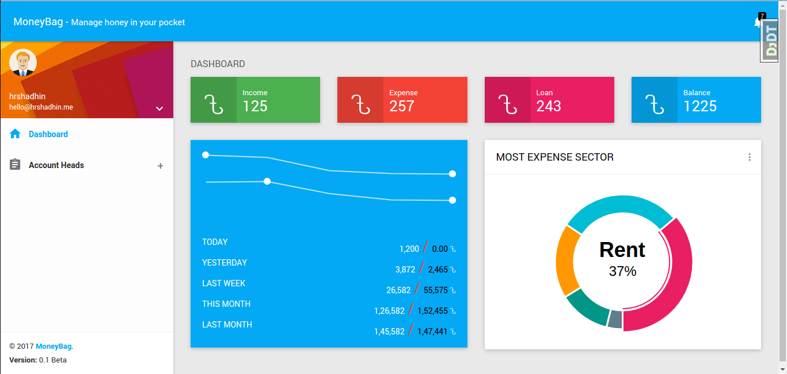

# MoneyBag [](https://travis-ci.org/pyprism/MoneyBag) [](https://coveralls.io/github/pyprism/MoneyBag?branch=master) [](https://requires.io/github/pyprism/MoneyBag/requirements/?branch=master)
:moneybag: Manage honey in your  pocket :moneybag:

This app helps to manage finance according to Chart Of Accounts. All data stored in db encrypted. For encryption its use AES-256!

### Screenshots


<a href="https://github.com/pyprism/MoneyBag/tree/master/screenshots">More Screenshots</a>

### Requirements
- Python 3.6
- PostgreSQL
- Redis
- Web Server (eg: Apache, Nginx)
- OpenSSL Library and others

```sudo apt install libssl-dev libffi-dev python3-dev```

### Installation
- Download the [repository](https://github.com/pyprism/MoneyBag/releases/latest) and unzip into your server
- Open and point your terminal to the directory you unzipped MoneyBag
- Run the following commands:
    ```
    pip install -r requirements.txt
    cp config.json config.local.json

    ```
- Now put appropriate value in config.local.json using text editor
- then finally run
    ```
    ./manage.py migrate
    ./manage.py compress
    uwsgi --http :8000 --module proj.wsgi
    ```
Application is now running on port 8000
 ### TODO
 - [ ] More unit test

### Credits
- [Habibur Rahman Shadhin](https://github.com/hrshadhin)
- [Ashutosh Das](https://github.com/pyprism)

