# MoneyBag   
:moneybag: Manage honey in your  pocket :moneybag:

This app helps to manage finance according to Chart Of Accounts

# Status
wip

# Dependency
sudo apt-get install libffi-dev python3-dev

# screenshots

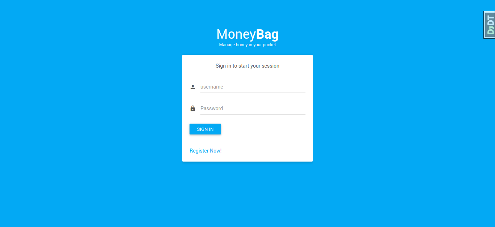
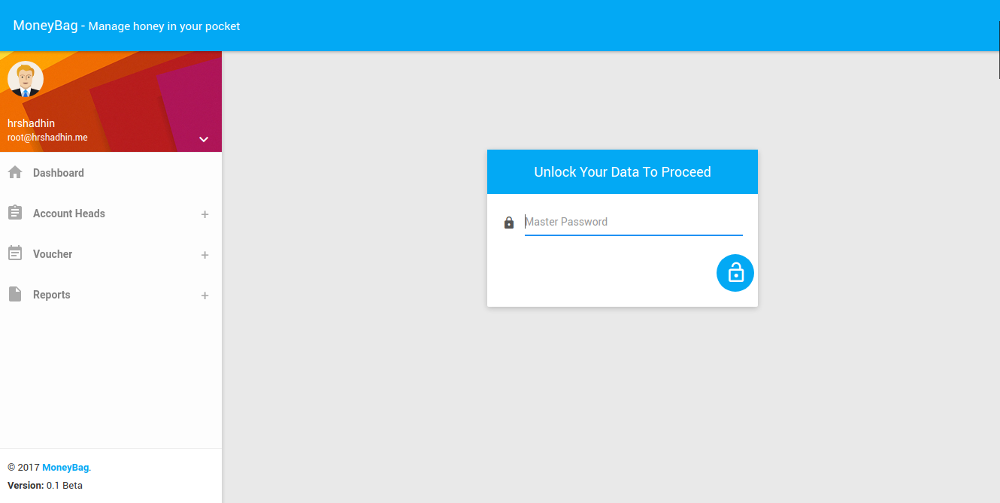

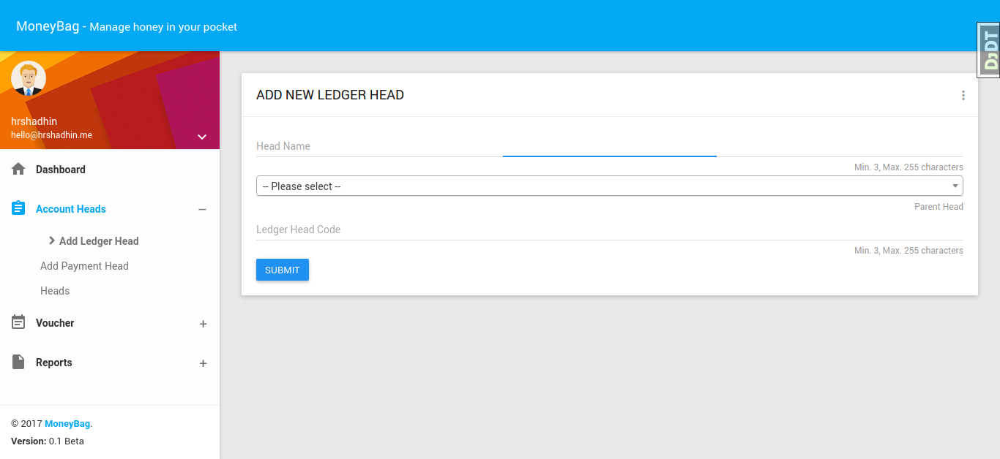
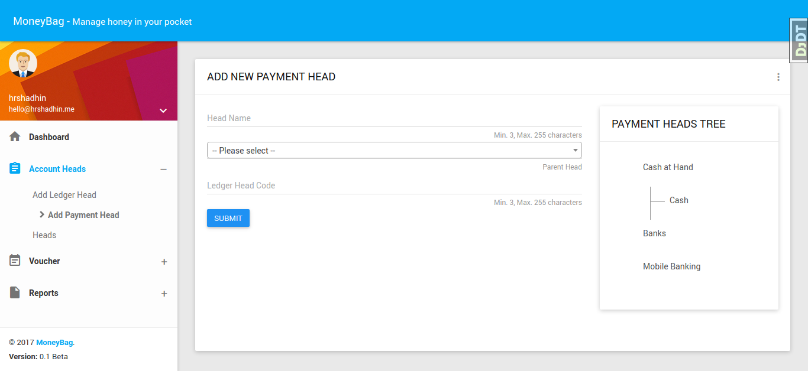
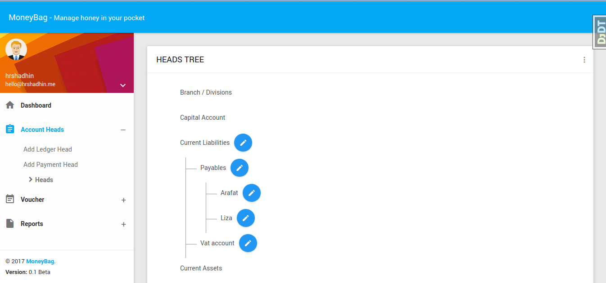
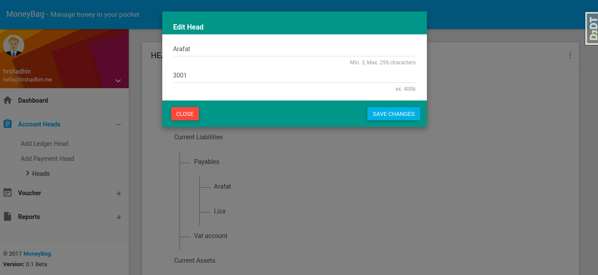
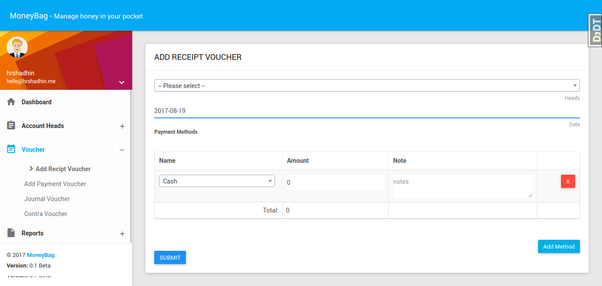
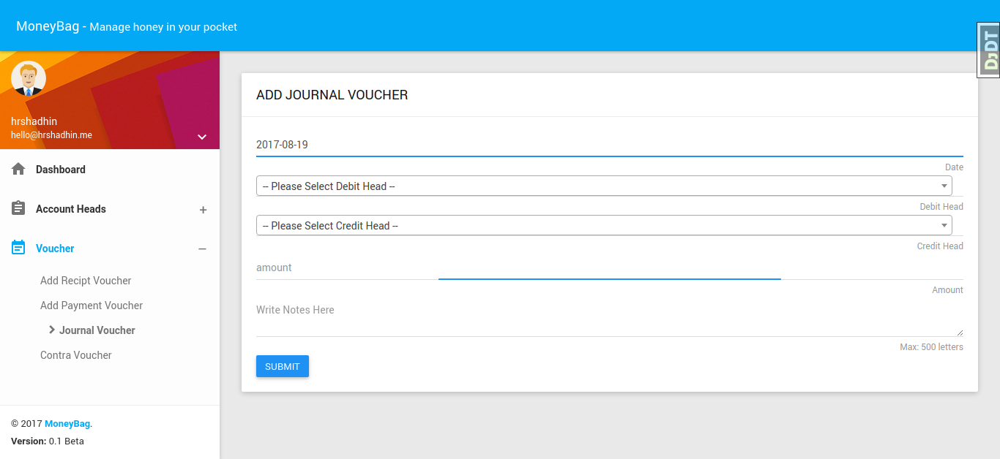
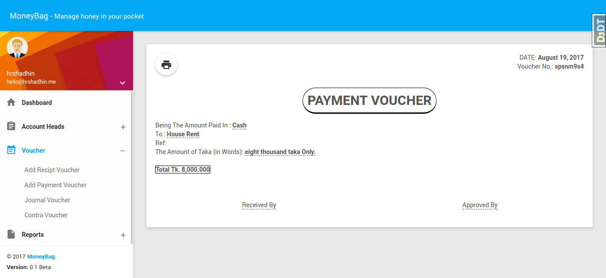
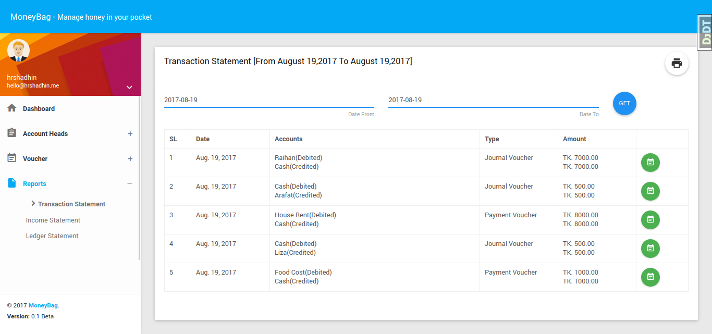
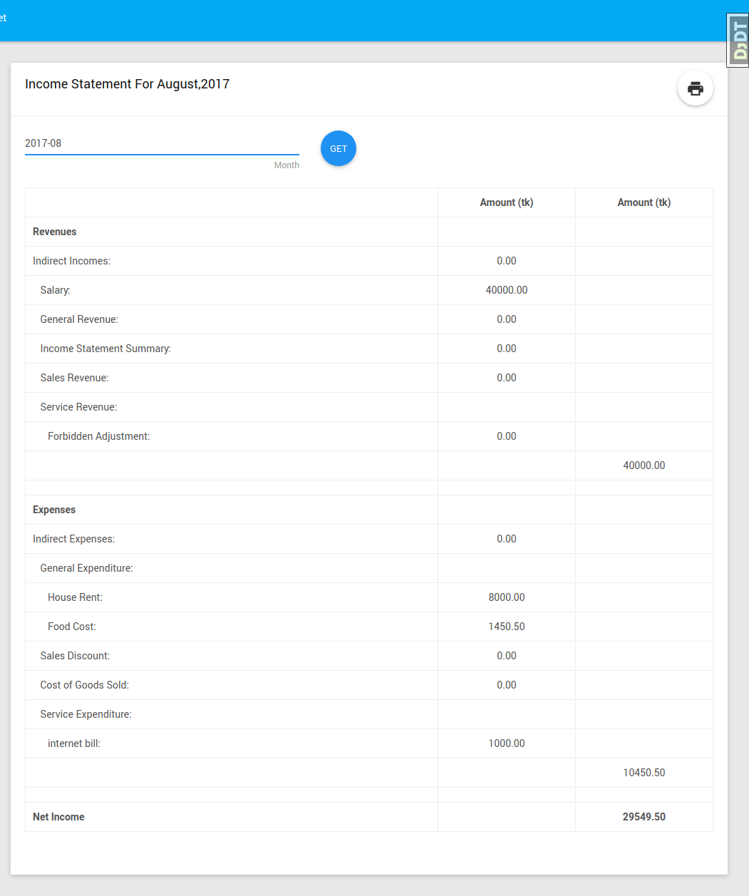
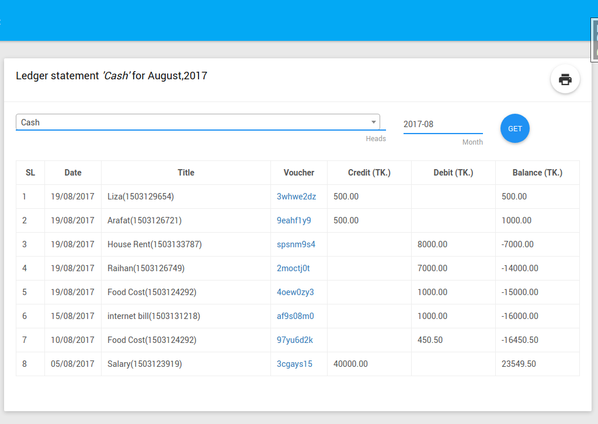
